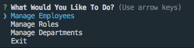
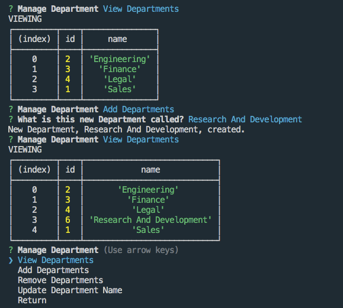
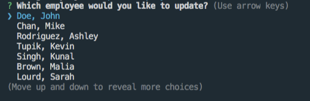
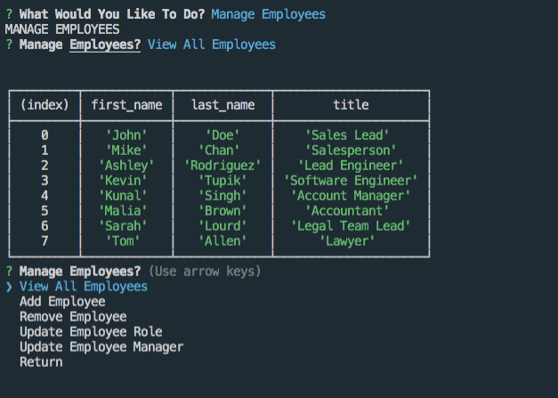

# employee_tracker


A Content Management System using a command line interface for organizing a company's employees, departments, and roles using node.js, inquirer, and mysql

---
### Table Of Contents
 
* [Installation](#installation)
* [Usage](#usage)
* [Contributing](#contributing)
* [Contact](#contact)
* [License](#license)
---

## Installation
 
Clone this repo from github and run ```npm i``` to install the necessary dependencies.
You will also need to initalize the mysql database using the provided database files in db.

---

## Usage

```npm start```

Using the CLI will bring you to a main menu where you are able to select between managing employees, roles, or departments.




### For example, managing departments looks like this:


### Other Examples of the program running:




---

## Contributing

Feel free to fork it and suggest whatever changes/tweaks might work.

---

## Contact

If you have any questions or are interested in this project, you can contact me, Chris Faux, at chrisfaux95@gmail.com.  Or if you feel so inclined, check out my Github profile: [chrisfaux95](https:/github.com/chrisfaux95).
    

---

## License

This project licensed under the [MIT](https://choosealicense.com/licenses/mit/) license.
